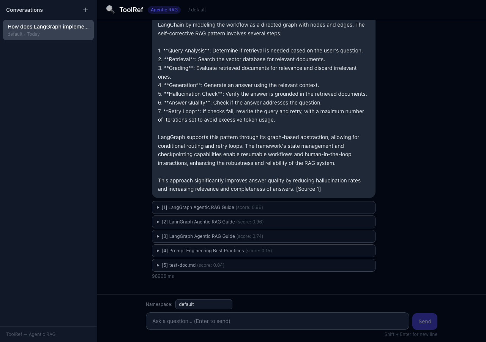

# ToolRef

> The reference engine for AI Agents — hot-swappable domain expertise via RAG + MCP.

**ToolRef** is a production-grade RAG engine that turns professional documentation into on-demand domain knowledge for AI Agents and humans. Each namespace is an isolated knowledge domain. Agents query via MCP; humans query via Chat UI.

🚧 **Status: Pre-alpha — Core RAG pipeline implemented, UI and deployment in progress**

## The Problem

AI Agents are powerful generalist reasoners, but they can't keep up with domain-specific knowledge:

- **Knowledge staleness** — Models are trained months ago. Framework APIs change weekly.
- **No depth** — An LLM "knows" LangGraph exists, but can't tell you the exact `StateGraph` parameter signature in v0.3.
- **No boundaries** — When an Agent answers from general training data, you can't audit where the answer came from or control what it sees.

Web search helps with public, popular content. But professional documentation — framework references, design specifications, internal standards — needs structured, version-aware, traceable retrieval.

## The Thesis

> AI should not be omniscient generalists. The future is **generalist reasoning + on-demand specialized knowledge**.

This is the [Context Engineering](https://simonwillison.net/2025/Jun/27/context-engineering/) insight: **what matters isn't model size, but the quality of context you provide.** A focused 300-token context often outperforms an unfocused 100K-token dump.

ToolRef is the knowledge layer that makes this practical:

- **For Agents** — Query domain knowledge via MCP tools (`rag_query`, `document_add`, `namespace_list`). Like giving an Agent a hot-swappable expert reference library.
- **For Humans** — Ask questions in a Chat UI with traceable citations back to source documents.

## Why Not Just Use...

| Solution | What it does | What it doesn't do |
|---|---|---|
| **Longer context windows** | Fit more text in one prompt | Solve attention degradation, cost scaling, or knowledge staleness |
| **Web search / Perplexity** | Find public, popular content | Index professional docs, provide version-precise answers, or audit sources |
| **Mem0 / OpenMemory** | Remember what a *user* said | Know what a *domain* is about |
| **RAGFlow** | Enterprise document platform | Lightweight, MCP-native, developer-first |
| **MCP RAG demos** | Prove the pattern works | Production quality — no hybrid retrieval, reranking, evaluation, or namespace isolation |

ToolRef sits in the gap: **MCP-native, production-grade RAG with retrieval quality you can measure.**

## Demo



*Chat UI showing a self-corrective RAG query with BGE-M3 retrieval, cross-encoder reranking, and traceable source citations.*

## Architecture

```
┌─────────────┐     ┌─────────────┐
│   Chat UI   │     │  AI Agent   │
│  (React)    │     │ (via MCP)   │
└──────┬──────┘     └──────┬──────┘
       │                   │
       └───────┬───────────┘
               ▼
       ┌───────────────┐
       │   FastAPI      │
       │   Gateway      │
       └───────┬───────┘
               ▼
       ┌───────────────────────────────────┐
       │         LangGraph RAG Engine       │
       │                                   │
       │  analyze_query → route →          │──► Redis
       │  hybrid_retrieve                  │    (semantic cache)
       │    ├─ dense  (HNSW cosine)        │
       │    ├─ sparse (SPARSE_INVERTED)    │
       │    └─ RRF fusion (k=60)           │
       │  rerank (BGE-reranker-v2-m3) →   │
       │  grade (fast-path ≥0.5 or LLM) → │
       │  generate / rewrite (max ×2)      │
       └───────────────┬───────────────────┘
                       ▼
  ┌──────────────┬───────┬──────────┬───────┐
  │    Milvus    │ Redis │ Postgres │ MinIO │
  │ HNSW+SPARSE  │ cache │ metadata │  docs │
  └──────────────┴───────┴──────────┴───────┘
```

### Key Components

- **Ingestion Pipeline** — Parse (PDF/MD/TXT via Unstructured.io) → hierarchical chunking (parent 1024t + child 256t) → BGE-M3 embedding (1024-dim dense + sparse) → Milvus (vectors) + PostgreSQL (metadata) + MinIO (raw files)
- **Retrieval Engine** — LangGraph state machine: `analyze_query → route → hybrid_retrieve (BGE-M3 dense+sparse, application-level RRF k=60) → rerank (BGE-reranker-v2-m3, top-5) → grade (reranker score ≥0.5 fast-path, else LLM judge) → generate / rewrite` — CRAG self-correction loops up to 2 retries
- **Semantic Cache** — Redis-backed, cosine similarity threshold 0.92, 24h TTL. Cache hit latency: ~225ms vs 27–60s uncached.
- **MCP Server** — Exposes `rag_query`, `document_add`, `namespace_list` as MCP tools
- **Namespace Isolation** — Each knowledge domain is a separate namespace with independent vector collections (verified: no cross-namespace leakage)
- **Evaluation Pipeline** — RAGAS framework (IR-only + full mode) + custom IR metrics (Hit Rate@K, MRR, Precision@K, Recall@K); `eval/run.py`

## Tech Stack

| Layer | Technology |
|---|---|
| API | FastAPI |
| Orchestration | LangGraph |
| Embeddings | BGE-M3 (1024-dim, dense + sparse) |
| Reranking | BGE-reranker-v2-m3 |
| Vector DB | Milvus (HNSW + SPARSE_INVERTED_INDEX) |
| Metadata DB | PostgreSQL 16 |
| Cache | Redis 7 |
| Object Storage | MinIO |
| Parsing | Unstructured.io |
| Frontend | React 18 + TypeScript + Vite |
| Evaluation | RAGAS + Custom IR Metrics |
| LLM (dev) | Ollama + Qwen2.5:14b |
| LLM (prod) | DeepSeek-V3 / GPT-4o / Claude (swappable) |

## Design Principles

1. **Close to users and data, not to models.** Models are swappable. Knowledge management and precision retrieval are the core.
2. **Every component earns its place.** Hybrid retrieval, reranking, self-correction — each has comparative experiment data proving its value over the simpler alternative.
3. **MCP-native.** Not a web app with MCP bolted on. The MCP interface is a first-class citizen.
4. **Namespace isolation.** Knowledge domains don't leak into each other. An Agent querying LangGraph docs never gets React docs mixed in.

## Roadmap

- ✅ **MVP (Weeks 1-3):** Scaffolding, PDF/MD/TXT parsing, hierarchical chunking, BGE-M3 embedding, Milvus dense+sparse indexing, basic Chat UI
- ✅ **V1 (Weeks 4-9):** Full agentic RAG flow (LangGraph), hybrid retrieval (dense+sparse+RRF), cross-encoder reranking with fast-path grading, CRAG self-correction, SSE streaming, semantic cache, MCP server, RAGAS evaluation + custom IR metrics, namespace isolation, 9-container Docker Compose setup, 47 unit tests
- 🚧 **V2 (Weeks 10-12, optional):** GraphRAG, human-in-the-loop, incremental re-indexing, additional document connectors

## Quick Start

**Prerequisites:** Docker + Docker Compose, [Ollama](https://ollama.com) running locally with `qwen2.5:14b` pulled.

### 1. Start all services

```bash
docker compose up -d
```

This starts 9 containers: backend, frontend, milvus, minio, redis, postgres, nginx, embedding-service, reranker-service. Wait ~60s for Milvus to become healthy:

```bash
docker compose ps
```

### 2. Upload a document

```bash
curl -X POST http://localhost:8000/api/v1/documents \
  -H "X-API-Key: dev-key" \
  -F "file=@your-doc.pdf" \
  -F "namespace=default"
```

### 3. Query via API

```bash
curl -X POST http://localhost:8000/api/v1/query \
  -H "Content-Type: application/json" \
  -H "X-API-Key: dev-key" \
  -d '{"query": "your question here", "namespace": "default"}'
```

Or open the Chat UI at **http://localhost:3000**.

## Evaluation

ToolRef ships with a RAGAS-based evaluation framework (`eval/run.py`).

### Metrics (dev corpus, Qwen2.5:14b on CPU)

| Metric | Result |
|---|---|
| Hit Rate@5 | 100% |
| MRR | 1.0 |
| Recall@5 | 100% |
| CRAG rewrite false-positive rate | 0% |

### Performance

| Scenario | Latency |
|---|---|
| Semantic cache hit | ~225ms |
| Reranker fast-path grading | 0ms (LLM judge skipped) |
| In-scope query, end-to-end | 27–60s (CPU, Ollama inference) |
| BGE-M3 embedding (per chunk) | ~0.5s |
| BGE-reranker reranking (10 docs) | ~6s |

### Run evaluation

```bash
# IR-only mode (fast, no LLM grading)
python eval/run.py --mode ir

# Full RAGAS mode (faithfulness + answer relevance)
python eval/run.py --mode full
```

## Running Tests

```bash
cd backend
pytest tests/unit/ -v
```

47 unit tests covering embedder, hybrid search / RRF, IR metrics, and JSON parsing. All tests are fully mocked — no external services required. Runs in ~2s.

## License

MIT

---

*Built by [Toolman Lab](https://github.com/toolmanlab) — where tools get serious.*
